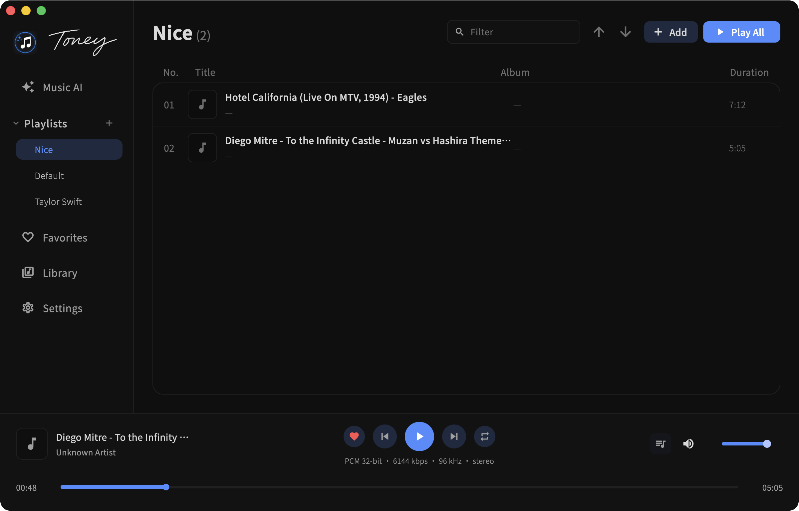

# Toney Music

- English | 简体中文 (README-zh_CN.md)

Toney Music is a bit-perfect focused music player with AI-native discovery and control. It targets macOS and Windows today, with expansion paths to iOS, Android, and beyond.



## What's inside right now

- **macOS (arm64) build**: release output at `build/macos/Build/Products/Release/toney.app` and a ready-to-share DMG at `build/toney-music-unsigned.dmg`.
- **Windows (x64) build**: release output at `build/windows/x64/runner/Release/toney.exe` with FFmpeg DLLs copied from `third_party/ffmpeg-audio/bin`.
- **Playback pipeline**: now playing bar, queue management, favorites, playlists, and library import (local + remote via Samba/WebDAV/FTP/SFTP path records).
- **Bit-perfect + auto sample-rate** toggles on macOS (CoreAudio) and Windows (WASAPI), with error dialogs that are easy to copy.
- **Music AI**: For You recommendations via LiteAgent SDK and a tool-calling chat wired to playback and library actions.
- **Diagnostics**: logs at `~/Library/Application Support/<app>/log/app_debug.log`; AI chat logs stored for per-message inspection.
- **Internationalization**: English and 简体中文 via generated `lib/l10n/app_localizations*.dart`.

## Build & run (macOS)

Prereqs: Flutter (desktop enabled), Xcode toolchain, macOS arm64. Bit-perfect requires CoreAudio device access (the app will prompt for folder access to create logs).

```bash
flutter gen-l10n        # optional, already checked in
flutter build macos --release
# app: build/macos/Build/Products/Release/toney.app
# DMG (optional):
rm -rf build/dmg-staging
mkdir -p build/dmg-staging
cp -R build/macos/Build/Products/Release/toney.app build/dmg-staging/
ln -sf /Applications build/dmg-staging/Applications
echo "Drag toney.app into Applications to install." > build/dmg-staging/README.txt
hdiutil create -volname "Toney Music" -srcfolder build/dmg-staging -ov -format UDZO build/toney-music-unsigned.dmg
```

## Build & run (Windows)

Prereqs: Flutter (desktop enabled), Visual Studio toolchain, Windows Developer Mode for symlinks.

```powershell
flutter build windows --release
# app: build/windows/x64/runner/Release/toney.exe
```

### Windows installer (Inno Setup)

```powershell
ISCC windows/installer/toney.iss
# output: build/installer/Toney-Setup-0.1.0.exe
```

## Roadmap / upcoming

Windows support is already in place; next focus areas are:
- iOS/Android builds once FFmpeg and the audio stack are ready per-platform.
- NetDisk/NFS and smarter caching/prefetch for remote sources.
- More AI surfaces (stories, tagging flows) and richer agent diagnostics.
